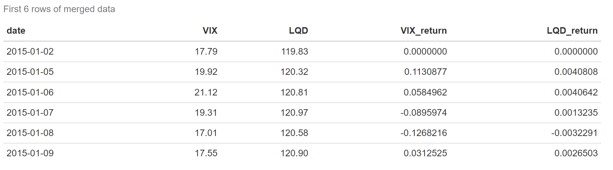

# Credit Spreads and Market Volatility Analysis

## Project Overview
This project analyzes the relationship between **credit spreads** (proxied by the LQD ETF) and **market volatility** (VIX) from 2015 to the present.  
Understanding this relationship helps investors assess market risk and make informed investment decisions.

---

## Data Sources
- **LQD ETF**: iShares iBoxx $ Investment Grade Corporate Bond ETF (Yahoo Finance)  
- **VIX**: CBOE Volatility Index (Yahoo Finance)  

Data is pulled programmatically using the `quantmod` package in R.

---

## Methodology
1. **Data Collection**: Download daily closing prices for LQD and VIX.  
2. **Data Preparation**: Merge time series, calculate daily log returns, and clean missing values.  
3. **Exploratory Data Analysis**: Summary statistics and time series visualizations.  
4. **Statistical Analysis**:
   - Compute correlation between VIX and LQD.  
   - Perform linear regression of LQD on VIX.  
   - Estimate robust standard errors using `sandwich` and `lmtest`.  
5. **Visualization**:
   - Time series plots of LQD and VIX.  
   - Scatter plot with regression line.

---

## Key Findings

### Preview of the Dataset
The following table represents a preview of the dataset after merging VIX and LQD data:

### Summary Statistics
The following table represents basic descriptive statistics for the VIX and LQD data, including their daily returns.  
This helps summarize the range, median, mean, and overall distribution of the data.  

### Graph 1: VIX vs LQD ETF Over Time
The following line chart shows the VIX index and LQD ETF closing prices over time (2015–present).  
It helps visualize how market volatility and credit spreads move over time.  

### Graph 2: Scatter Plot of LQD vs VIX
This scatter plot shows the relationship between LQD ETF prices and the VIX index, along with a linear regression line.  
It helps illustrate the correlation between market volatility and credit spreads.  

### Summary of Findings
- LQD and VIX exhibit a positive correlation.  
- Linear regression shows that increases in VIX are associated with higher LQD values.  
- Robust standard errors confirm the statistical significance of the relationship.

